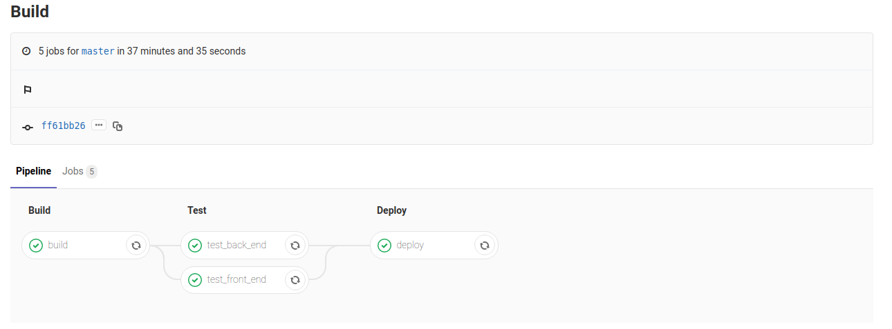

 
# Tools and practices: Continuous Integration and Deployment

* [Στέφανος Γεωργίου](https://www.balab.aueb.gr/stefanos-georgiou.html)


# Agenda
* What is CI/CD?
* AllCanCode Case
* Without CI/CD
* Build stages
* Caching data
* Optimizations
* First CI pipeline
* Point out drawbacks
* Second Attemp
* Outcome


# What is CI/CD
* CI = Continuous Integration
* CD = Continuous Deployment
* Reducing manual labor for deployment and lessens testing time of newly integrated code.


# AllCanCode Platform


# ACC Process


# Without CI/CD
* Running back-end tests (using mocha-chai)
* Manually perform front-end test on the platform
* Depoy to Google's App Engine the platform
	* Alpha
	* WWW
	* Next
* Running cordova to build native code, singing, and deploying
	* APKs to Play Store
	* IPAs to App Store
* Approximate time: 40 minutes


# Challenges
* Automate front-end testing
* Automate CI/CD
* Automate mobile apps build and deployment


# Automate front-end testing


# Cypress example
<video controls>
    <source src="media/acc_front_end_testing_with_cypress.mp4" type="video/mp4">
</video>


# Enabling CI/CD on GitLab
* Just create a .gitlab-ci.yml in your project's root directory
	* Declare Stages
	* Cache data or modules
	* Install dependencies on container or VM
* On push the CI/CD pipeline will be executed
* Upon success or failure you are being notified by an email


# Simple YAML
```
image: node:latest
job:
  before_script:
    - apt update
    - apt install -y apt-transport-https ca-certificates curl gnupg2 software-properties-common
  script:
    - cd js_apps
    - npm i
    - npm test
```


# Build stages
* To group jobs and run them sequencially or in parallel (e.g., testing different  environments)
* Works as a pipeline among build stages
* Can cache and pass data and modules among build stages
* Suggested stages: build, test, deploy, and release
```
stages:
  - build
  - test
  - deploy
  - release
```


# Multiple Evnironments


# Caching data (1)
* To store directories among builds, usually dependencies that take longer to compile or download (npm, pip, Maven)
* Uploads the cached data after the script phase but before after success or failure
* Large files that are quick to install but slow to download do not benefit from caching
```
cache:
  untracked: true
  paths:
    - node_modules/
```


# Caching data (2)


# First CI pipeline
```
cache:
  untracked: true
  paths:
    - node_modules/

stages:
  - build
  - test
  - deploy

build:
  stage: build [...]

test_back_end:
  stage: test [...]

test_front_end:
  stage: test [...]

deploy:
  stage: deploy [...]
```


# First CI, build
```
build:
  stage: build
  image: node:latest
  before_script:
    - apt-get update
  script:
    - npm i
    - export ACC_VERSION=$(node -pe "require('./package.json')['version']")
    - export DEPLOY_URL=$(echo "https://files.allcancode.com/builds/app-files/platform/${ACC_VERSION}/")
    - echo ${ACC_VERSION}
    - cd acc-front
    - rm -rf node_modules/*
    - npm i
    - node_modules/@angular/cli/bin/ng build --prod --build-optimizer --preserve-symlinks --base-href / --deploy-url ${DEPLOY_URL}
    - cd ..
```


# First CI, test
```
test_back_end:
  stage: test
  image: node:latest
  before_script:
    - apt-get update
    - apt install -y xvfb libgtk2.0-0 libnotify-dev libgconf-2-4 libnss3 libxss1 libasound2
    - apt install -y apt-transport-https ca-certificates curl gnupg2 software-properties-common redis-server
    - service redis-server start
  script:
    - sh test.sh
```


# First CI, test
```
test_front_end:
  stage: test
  image: node:latest
  before_script:
    - apt-get update
    - apt-get install -y xvfb libgtk2.0-0 libnotify-dev libgconf-2-4 libnss3 libxss1 libasound2
    - npm i --save-dev cypress
  script:
    - bash cli.sh remote &
    - cd acc-front
    - bash devrun.sh &
    - cd ../
    - bash checkRunning.sh
    - node_modules/cypress/bin/cypress run --spec cypress/integration/acc-front/login.spec.js
    - node_modules/cypress/bin/cypress run --spec cypress/integration/acc-front/projectPage.spec.js
```


# First CI, deploy
```
deploy:
  stage: deploy
  image: google/cloud-sdk:latest
  before_script:
    - export ACC_VERSION=$(cat ACC_VERSION)
    - export ACC_VERSION=$(echo ${ACC_VERSION} | awk '{print $2}')
    - echo ${ACC_VERSION}
    - echo $SERVICE_ACCOUNT > /tmp/$CI_PIPELINE_ID.json
    - gcloud auth activate-service-account --key-file /tmp/$CI_PIPELINE_ID.json
    - gcloud config set project allcancode-platform
  after_script:
    - rm /tmp/$CI_PIPELINE_ID.json
    - rm ACC_VERSION
  script:
    - export STORAGE_PATH=$( echo "gs://allcancode-files/builds/app-files/platform/${ACC_VERSION}")
    - gsutil -m cp -r -z html,css,js acc-front/dist ${STORAGE_PATH}
    - gsutil -m setmeta -h "Cache-Control:public, max-age=31536000" ${STORAGE_PATH}/**/*
    - gsutil -m acl ch -r -u AllUsers:R ${STORAGE_PATH}/*
    - gcloud app deploy app-alpha.yaml --version=v${ACC_VERSION//\./\-} --quiet
```


# First CI outcome



# Pointing out drawbacks
* Necessary to cache all data between stages?
* Do we need all these stages?
* Should every branch execute all stages?


# Optimizations on caching
```
build_acc_front:
  stage: build
  image: node:11.15.0
  cache:
    untracked: true
    paths:
      - acc-front/dist/*
      - [...]
```


# Optimizations on stages
```
deploy_to_gcloud:
  stage: deploy
  image: google/cloud-sdk:latest
  only:
    - master [...]

test_front:
  stage: test
  image: node:11.15.0
  except:
    - master [...]
```


# Merging stages


# Outcome of CI/CD pipeline


