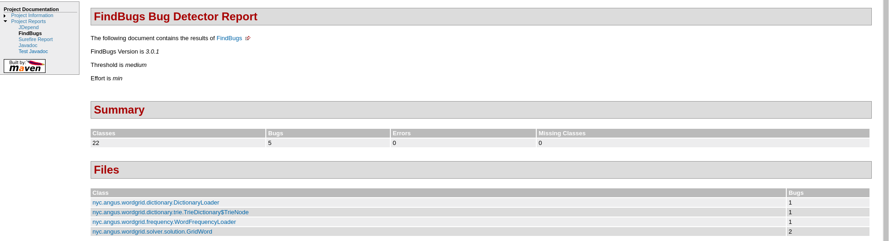

 
# Tools and practices: Continuous Integration

* [Στέφανος Γεωργίου](https://www.balab.aueb.gr/stefanos-georgiou.html)


# Utilizing Travis for GitHub Java Projects

* [Use case repository](https://github.com/stefanos1316/wordbrain-solver)
* Maven([pom.xml](https://github.com/stefanos1316/wordbrain-solver/blob/master/pom.xml))  
	* Dependencies
	* Build
		* [JaCoCo](http://www.eclemma.org/jacoco/trunk/doc/maven.html), [Coveralls](https://github.com/trautonen/coveralls-maven-plugin)
	* Reporting
		* [CheckStyles](https://maven.apache.org/plugins/maven-checkstyle-plugin/), [JDepend](http://www.mojohaus.org/jdepend-maven-plugin/), [FindBugs](https://gleclaire.github.io/findbugs-maven-plugin/), [PMD](https://maven.apache.org/plugins/maven-pmd-plugin/), [JavaDoc](https://maven.apache.org/plugins/maven-javadoc-plugin/usage.html), [Surefire](http://maven.apache.org/surefire/maven-surefire-plugin/)


# Travis, JaCoCo, Coveralls (1)

```java
<plugin>
    <groupId>org.jacoco</groupId>
    <artifactId>jacoco-maven-plugin</artifactId>
    <version>0.7.4.201502262128 </version>
    <executions>
        <execution>
            <id>pre-unit-test</id>
            <goals>
                <goal>prepare-agent</goal>
            </goals>
            <configuration>
                <propertyName>surefireArgLine</propertyName>
            </configuration>
        </execution>
        <execution>
            <id>post-unit-test</id>
            <phase>test</phase>
            <goals>
                <goal>report</goal>
            </goals>
        </execution>
    </executions>
    <configuration>
        <excludes>
            <exclude>**/ui/**</exclude>
            <exclude>**/StartSolverUi**</exclude>
        </excludes>
    </configuration>
</plugin>
```


# Travis, JaCoCo, Coveralls (2)

* Remember to webhook your repository from coveralls.io site
* [coveralls-maven-plugin](https://github.com/trautonen/coveralls-maven-plugin): JaCoCo, Cobertura, Saga
```java
<plugin>
    <groupId>org.eluder.coveralls</groupId>
    <artifactId>coveralls-maven-plugin</artifactId>
    <version>3.1.0</version>
</plugin>
```

* .travis.yml
```java
language: java			
script: mvn test
after_success:
  	- mvn clean test jacoco:report coveralls:report	
jdk:
  	- oraclejdk8
```


# Travis, JaCoCo, Coveralls (3)


# Travis with CheckStyles 
* .travis.yml
```java
	language: java
	jdk:
  		- oraclejdk8
	script:
  		- mvn test checkstyle:check
```
* Output: *[ERROR] ...  You have 323 Checkstyle violations. -> [Help 1]*


# Travis with jDepend, FindBugs, JavaDoc

* .travis.yml
```java
language: java
jdk:
  	- oraclejdk8			
script:
	- mvn site				
```


# FindBugs and JDepend




# Thank you for your attention!!!
