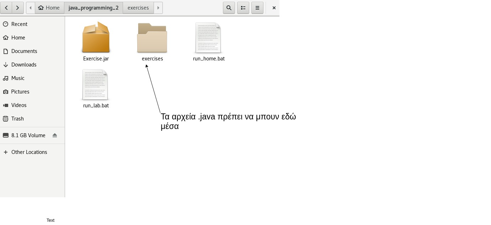

 
# Προγραμματισμός ΙΙ
## Φροντιστήριο 1 (Β' μέρος)

* [Στέφανος Γεωργίου](https://www.balab.aueb.gr/stefanos-georgiou.html)
* [Θεόδωρος Στασινόπουλος](https://www.balab.aueb.gr/theodore-stassinopoulos.html)


## Στοιχεία Μαθήματος

* **Μάθημα**: Προγραμματισμός ΙΙ
* **Καθηγητής**: Διομήδης Σπινέλλης 
* **Βοηθοί**: Στέφανος Γεωργίου και Θεόδωρος Στασσινόπουλος
* **Θεωρία** και **ατομικές ασκήσεις**: κάθε **Δευτέρα**. 3-5μμ, Δ23
* **Πρακτικές** και **ομαδικές ασκήσεις**: κάθε **Τετάρτη** 3-5μμ, Α23
* **Φροντιστήριο**: κάθε **Τρίτη**, 3-5μμ, Α23
* **Εργαστήριο**: 4 ώρες/εβδομάδα (**Τετάρτη** και **Πέμπτη**, 5-7μμ, ELOI2)


## Σημειώσεις μαθήματος


[https://edu.dmst.aueb.gr/course/view.php?id=20](https://edu.dmst.aueb.gr/course/view.php?id=20)


## Σημειώσεις Θεωρίας και Σύνδεσμοι Ατομικώ Ασκήσεων


[https://www2.dmst.aueb.gr/dds/isdi/index.htm](https://www2.dmst.aueb.gr/dds/isdi/index.htm)


## Ατομικές Ασκήσεις


[https://www2.dmst.aueb.gr/dds/isdi/exercise/index.htm](https://www2.dmst.aueb.gr/dds/isdi/exercise/index.htm)


## Αξιολόγηση Συμμετοχής


[https://www2.dmst.aueb.gr/dds/isdi/intro/token.htm](https://www2.dmst.aueb.gr/dds/isdi/intro/token.htm)


## Φροντιστηριακές Παραδόσεις

* Εκμάθηση και υποστήριξη του **Jarpeb** (Java Randomised and Psersonalized Exercise Builder)
* Επεξήγηση ασκήσεων ατομικών
* Επίλυση αποριών και ασκήσεων


## Απαιτήσεις για το Σύστημα Ασκήσεων

* Να έχετ **εγκαταστήσει** τη [Java](http://www.oracle.com/technetwork/java/javase/downloads/index.html) (τουλάχιστον jdk 1.7)
* Να **ακολουθήσετε** τον [**Οδηγό Εγκατάστασης Jarpeb**](https://edu.dmst.aueb.gr/pluginfile.php/9682/mod_resource/content/0/%CE%9F%CE%B4%CE%B7%CE%B3%CF%8C%CF%82%20%CE%95%CE%B3%CE%BA%CE%B1%CF%84%CE%AC%CF%83%CF%84%CE%B1%CF%83%CE%B7%CF%82%20Jarpeb.pdf)


## Κριτήρια Βαθμολογίας Ατομικών Ασκήσεων 

* Υλοποίηση του προγράμματος κάθε άσκησης
* Μορφοποίηση του προγράμματος κάθε άσκησης
* Απαντήσεις στις ερωτήσεις πολλαπλής επιλογής


## Προγραμματισμός σε Java

* Διορθωτής (editor) + Μεταγλωττιστής (compiler)
**ή**
* Ολοκληρωμένο Περιβάλλον Ανάπτυξης Εφαρμογών (Integrated Development Environment - IDE)


## Editors

* TextPad
* Notepad++
* Notepad
* Vim
* Emacs
* Sublime
* TextEdit


## Integrated  Development Environments - IDEs

* Eclipse
* NetBeans
* IntelliJ


## Παράδειγμα 1

 


## Μεταγλώττιση και Εκτέλεση από τη Γραμμή Εντολών

* Μεταγλωττίζουμε το πρόγραμμα με την εντολή **javac <όνομα αρχείου.java>**
* Αν δεν έχουμε κάνει λάθη τότε θα δημιουργηθεί ένα αρχείο με κατάληξη **.class**
* Εκτελούμε το πρόγραμμα με την εντολή **java <όνομα αρχείου>** (χωρίς την κατάληξη .class)


## Παράδειγμα 2





## Έλεγχος Υλοποιήσης


##  Ποιότητα Μπρφοποίησης

* Κενό πριν την αγκύλη {
* Όχι κενό μετά την παρένθεση (
* Κενό πριν και μετά τους τελεστές (==, <, >, &&, ||…)
* Κενό πριν και μετά τα σύμβολα των πράξεων (+, -, \, %)
* 1 κενή γραμμή πριν κάθε νέα μέθοδο

```java
	if {
		...
	} else {
		...
	}
```


## Έλεγχος Καταχώρησης


