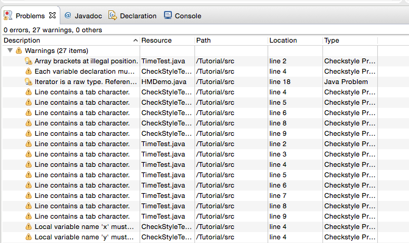

 
# Προγραμματισμός ΙΙ
# Πλατφόρμα Eclipse

* [Στέφανος Γεωργίου](https://www.balab.aueb.gr/stefanos-georgiou.html)
* [Θεόδωρος Στασινόπουλος](https://www.balab.aueb.gr/theodore-stassinopoulos.html)

## Eclipse, checkstyle and Find Bugs

## Επιλογή του Workspace

* [Download](https://www.eclipse.org/)

## Δημιουργία νέου έργου

## Ονομασία νέου έργου

## Δημιουργία νέας κλάσης 

## Μεταγλώττιση και εκτέλεση

## Εγκατάσταση plug-ins για Eclipse

* Help - >Install New Software*
* Στην καρτέλα Install πατάμε Αdd
* Στην επόμενη καρτέλα προσθέτουμε το όνομα του plug-in και το URL που βρίσκεται (π.χ. FindBugs, http://findbugs.cs.umd.edu/eclipse)
* Επιλέγουμε το project που θέλουμε να εγκαταστήσουμε
* Πατάμε Next αποδεχόμαστε τους όρους χρήσης επιλέγοντας Accept και τέλος επιλέγουμε Finish
* Επιλέγουμε restart για να ξεκινήσει ξανά το Eclipse (παρόμοια διαδικασία ισχύει όταν θέλετε να εγκαταστήσετε λογισμικό από το Εclipse MarketPlace π.χ. για το checkstyle)

## Εγκατάσταση FindBugs

[http://findbugs.cs.umd.edu/eclipse/](http://findbugs.cs.umd.edu/eclipse/)

## Εγκατάσταση CheckStyle

## Παράδειγμα CheckStyle

## Αποτελέσμα CheckStyle

