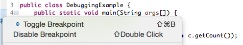

 
# Προγραμματισμός ΙΙ
# Debugging, BetterCodeHub, and JUnits

* [Στέφανος Γεωργίου](https://www.balab.aueb.gr/stefanos-georgiou.html)
* [Κωνσταντίνος Κραββαρίτης](https://www.balab.aueb.gr/konstantinos-kravvaritis.html)

## Αποσφαλμάτωση

* Ο εντοπισμός σφαλμάτων (debugging) μας επιτρέπει να τρέχουμε ένα 
πρόγραμμα και να παρατηρούμε τις τιμές που παίρνουν οι μεταβλητές 
του προγράμματός μας καθώς εκτελείται ο κώδικας.

* Χρησιμοποιούμε breakpoints μέσα στο πρόγραμμά μας, όπου θέλουμε 
να σταματήσει η εκτέλεση του κώδικα για να τσεκάρουμε τις τιμές 
των αντίστοιχων μεταβλητών.

## Αποσφαλμάτωση στο Eclipse (1)

* Προσθέτουμε τα breakpoints στο πρόγραμμα μας και στην συνέχεια 
επιλέγουμε την κλάση που θέλουμε να ελέξουμε από το menu των  Projects.

## Αποσαλμάτωση στο Eclipse (2)

* Πατάμε δεξί κλικ στην κλαση μας και επιλέγουμε **Debug as -> Java Application**

## Αποσφαλμάτωση στο Eclipse (2)

## BetterCodeHub

* Βοηθά στην δημιουργεία συντηρίσημου κώδικα.
* Συνδέεται με τον GitHub αποθετήριο. 
* Δίνει μετρήσεις για την κατάσταση του κώδικα.

[Σύνδεσμος](https://bettercodehub.com/)

## Σύνδεση μέσω GitHub

## Διεπαφή BetteCodeHub

## Ρυθμίσεις

## Βαθμολογία Κώδικα

## JUnit

* JUnit είναι ένα framework για να πραγματοποιήσουμε, να τεστάρουμε 
μεθόδους ή λειτουργίες στην java.
* Προσπαθούμε να τεστάρουμε όσες περισσότερες μεθόδους μπορούμε. Το αν μία
μέθοδος είναι εύκολο να τεσταριστεί είναι χαρακτηριστικό ποιοτικού κώδικα.
* Τεστάρουμε συνολικά τις κύριες λογικές λειτουργίες του προγραμματός μας σε
όσες περισοότερες διαφορετικές περιπτώσεις μπορούμε.
* Βασικός λόγος που είναι σημαντικό να γίνουν τα παραπάνω είναι ότι σε κάθε
μεταβολή του κωδικά μας να εχουμε αντίληψη για το ποιά άλλα κομμάτια του κώδικα
έχουν επηρεαστεί.

# JUnit και Eclipse(1)

* 1. Επιλέγουμε την κλάση που θέλουμε να τεστάρουμε. Με δεξί κλικ επιλέγουμε New
από το menu και στη συνέχεια JUnit Test Case.
* 2. Στο νέο παράθυρο που εμφανίζεται αφήνουμε το όνομα του νέου αρχείου
ως έχει π.χ. PrinterTest (Εδώ μπορούμε να επιλέξουμε και σε ποιό package θέλουμε
να βαλουμε τα tests). Eπιλέγουμε Next και ΟΚ.

# JUnit και Eclipse(2)

* 3. Σβήνουμε την fail μέσα στην test μέθοδο και προσθέσουμε τους ελέγχους
μας στην κλάση PrinterTest. Στη συνέχεια, πατάμε δεξί κλικ στην κλάση PrinterTest
στον κατάλογο με τα προγράμματα (Projects) και επιλέγουμε
Run As -> JUnit Test.
* 4. Αν θέλουμε να τρέξουμε μόνο ένα test, μπορούμε να κάνουμε δεξί κλικ πάνω
στο όνομα του και να επιλέξουμε πάλι
Run As -> JUnit Test.

# JUnit και Eclipse(3)

